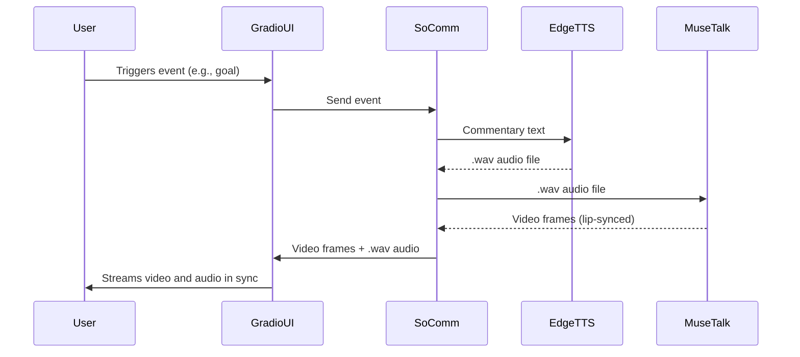

# Real-Time Soccer Commentator: Detailed Architecture

## 1. Component Overview

- **SoComm**: Orchestrates soccer event detection and commentary text generation.
- **EdgeTTS**: Converts text to speech, returns a `.wav` file.
- **MuseTalk**: Takes the `.wav` audio, generates lip-synced video frames in real time.
- **Gradio + WebRTC**: Streams both the generated video and the original audio to the browser, ensuring synchronization.

---

## 2. Detailed Data Flow

### Step 1: Event to Audio
- SoComm detects a soccer event and generates commentary text.
- The text is sent to EdgeTTS.
- EdgeTTS returns a `.wav` file containing the speech.

### Step 2: Audio to Video Frames
- The `.wav` file is passed to MuseTalk.
- MuseTalk processes the audio, splits it into chunks (according to FPS, e.g., 25 FPS), and generates a sequence of video frames, each lip-synced to the corresponding audio chunk.

### Step 3: Synchronizing Audio and Video
- **Key Point:** The number of video frames generated matches the number of audio chunks (frames = audio duration × FPS).
- **MuseTalk** outputs a directory or buffer of video frames (e.g., as numpy arrays or images).

### Step 4: Streaming with Gradio + WebRTC
- **Goal:** Stream the video frames and the original audio to the browser, so the user sees and hears the commentator in sync.
- **Approach:**
  - Use Gradio’s [WebRTC component](https://www.gradio.app/guides/object-detection-from-webcam-with-webrtc) to stream video frames in real time.
  - Use Gradio’s audio output component to send the `.wav` file to the browser.
  - On the frontend, start audio playback and video streaming at the same time for alignment.

---

## 3. Implementation Blueprint

### Backend (Python/Gradio)
```python
import gradio as gr
from gradio_webrtc import WebRTC
import numpy as np
import soundfile as sf

def socomm_event_handler(event):
    # 1. Generate commentary text
    commentary_text = generate_commentary(event)
    # 2. Get TTS audio (wav file)
    wav_path = edge_tts(commentary_text)  # returns path to .wav
    # 3. Generate MuseTalk video frames
    frames = musetalk_generate(wav_path)  # returns list of np.ndarray frames
    # 4. Return both audio and frames
    return frames, wav_path

def musetalk_generate(wav_path):
    # Call MuseTalk inference, return list of frames (np.ndarray)
    # Each frame is lip-synced to the corresponding audio chunk
    # ...
    return frames  # [np.ndarray, np.ndarray, ...]

def edge_tts(text):
    # Call EdgeTTS, save to wav_path
    # ...
    return wav_path

# Gradio UI
with gr.Blocks() as demo:
    event_input = gr.Textbox(label="Soccer Event")
    video_stream = WebRTC(label="Commentator Video")
    audio_output = gr.Audio(label="Commentator Audio", type="filepath")

    def process_event(event):
        frames, wav_path = socomm_event_handler(event)
        return frames, wav_path

    event_input.submit(
        fn=process_event,
        inputs=event_input,
        outputs=[video_stream, audio_output]
    )

demo.launch()
```
**Notes:**
- The `WebRTC` component streams video frames in real time.
- The `Audio` component sends the `.wav` file to the browser.
- On the frontend, you must ensure that audio playback and video streaming start together for perfect sync.

---

### Frontend (Browser/Gradio)
- Gradio handles the UI.
- When the user triggers an event, the backend returns both the video stream and the audio file.
- The browser starts playing the audio and displaying the video frames at the same time.

---

## 4. Synchronization Details

- **MuseTalk**: Generates frames at a fixed FPS (e.g., 25 FPS). The number of frames = audio duration × FPS.
- **Audio**: The `.wav` file is played at normal speed.
- **Frontend**: Start both audio and video together. If using Gradio’s built-in components, this is handled automatically when both outputs are returned at once.
- **If you want even tighter sync** (e.g., for live streaming), you may need to:
  - Buffer a few frames ahead.
  - Use timestamps to align video frame display with audio playback position.

---

## 5. Advanced: True Real-Time Streaming

If you want to stream audio and video as they are generated (not after the full `.wav` is ready):

- Use Gradio’s streaming API and WebRTC to send audio chunks and video frames as they are produced.
- This requires MuseTalk to support streaming inference (process audio in small chunks and output frames incrementally).
- The frontend must play audio and display video frames in lockstep.

---

## 6. Sequence Diagram



---

## 7. References
- [Gradio WebRTC Streaming Guide](https://www.gradio.app/guides/object-detection-from-webcam-with-webrtc)
- [MuseTalk Real-Time Inference](https://github.com/PKU-YuanGroup/MuseTalk)
- [EdgeTTS Documentation](https://github.com/rany2/edge-tts)

---

## 8. Key Points for Implementation
- **MuseTalk and EdgeTTS must use the same audio sample rate and duration for perfect sync.**
- **Gradio’s WebRTC and Audio components can be used together to deliver synchronized AV to the browser.**
- **For best UX, start audio and video playback together on the frontend.**
- **For advanced use, consider streaming audio and video in chunks for lower latency.** 

---
